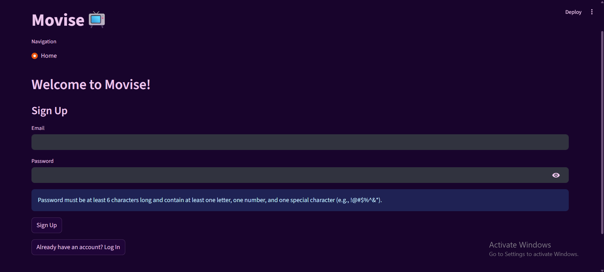
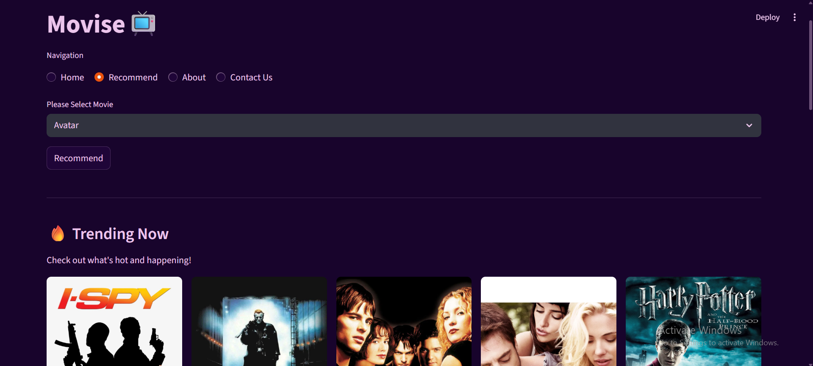
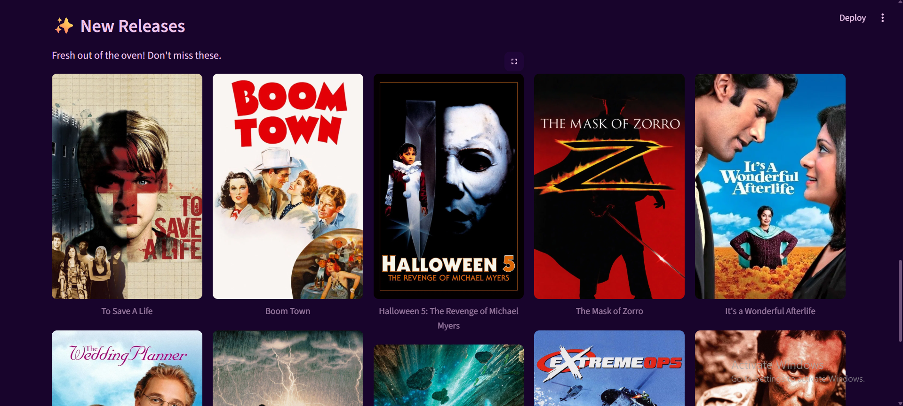
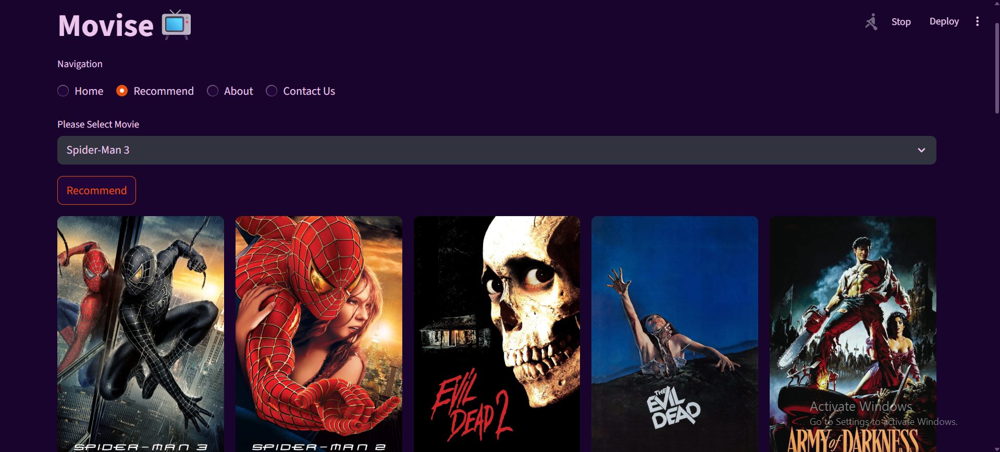
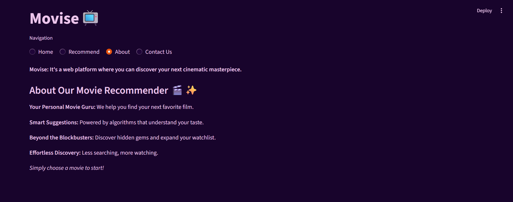
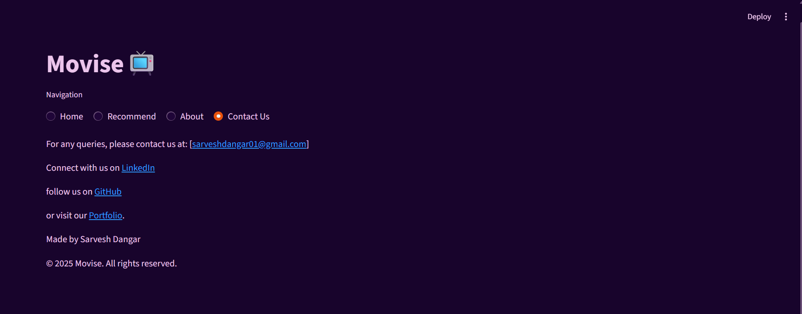
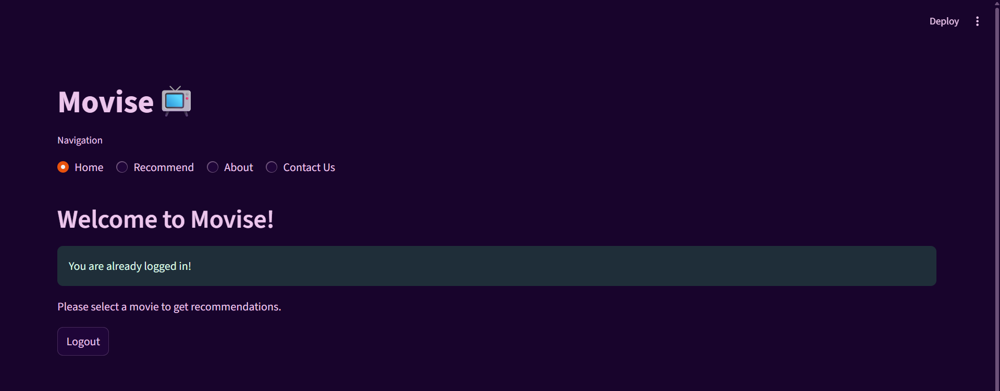

# 🎬 **Movise - Movie Recommender System**

Welcome to the **Movise - Movie Recommender System** repository!  
This project provides a **comprehensive movie recommendation engine**,  
leveraging machine learning techniques to suggest **personalized movie choices** based on various criteria.

---

## 📂 **Project Structure**

---

## 🖥️ **Features**

- 🎯 **Content-Based Filtering** — Uses genre, actors, directors, and plot keywords.
- 👥 **Collaborative Filtering**
  - **User-Based** — Find users with similar tastes.
  - **Item-Based** — Suggest similar movies to those you've liked.
- ⚡ **Hybrid Approach** — Combines both content and collaborative filtering.
- 🔎 **Search Functionality** — Search by movie title.
- 🧠 **Dynamic Learning** — Updates recommendations as new ratings come in.
- 🌐 **Web UI Support** — Optional frontend with Streamlit or Flask.

---

## 🌐 **Technologies Used**

- 🐍 **Python**
- 📊 **Pandas**, **NumPy** — Data processing
- 🤖 **Scikit-learn** — ML models (TF-IDF, cosine similarity)
- 📦 **Surprise** *(optional)* — Collaborative filtering
- 🌍 **TMDB API** *(optional)* — Movie posters and metadata
- 🧠 **NLP** *(optional)* — TF-IDF, Sentence Transformers
- 🌐 **Streamlit / Flask** *(optional)* — For web UI

---

## 🚀 **How to Run Locally**

### 1️⃣ Clone the repository
git clone https://github.com/SARVESH0717/Movise.git

### 2️⃣ Set up a virtual environment
<!-- For Windows: -->
python -m venv venv  

venv\Scripts\activate 

<!-- macOS/Linux: -->
python3 -m venv venv  

source venv/bin/activate

### 3️⃣ Install dependencies

pip install -r requirements.txt or OtherWise Do Manually One By One.

- For Datsets You can Download From [Kaggle](https://www.kaggle.com/datasets/tmdb/tmdb-movie-metadata/data)

### 4️⃣ Run the project
open cmd terminal in VS Code
Enter 
- streamlit run src/app.py

## 📸 Screenshots
### SignUp Page

### Trending Page

### New Release Page

### Recommendation

### About

### Contact Us

### Log Out

## 🌍 Live Demo

## 📬 Contact
- Developer: Sarvesh Dangar  
- 📧 Email: sarveshdangar01@gmail.com, sarudangar@gmail.com  
- 🔗 GitHub: https://github.com/SARVESH0717  

## 📃 License
This project is licensed under the MIT License.  

Feel free to fork, modify, and contribute!

## 🔖 Credits
- Design & Development: Sarvesh Dangar  
- Data: MovieLens, TMDB API (if used)  
- Libraries: Pandas, NumPy, Scikit-learn, Streamlit, Flask, Surprise, etc.
